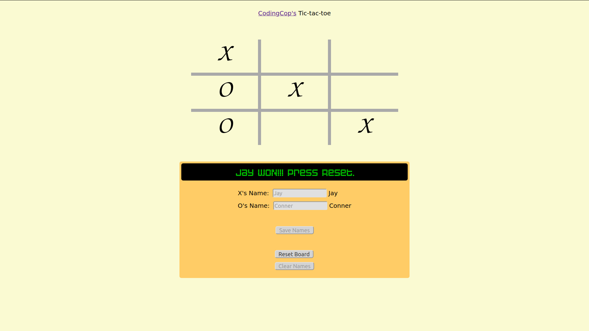

# HTML/CSS/JavaScript Tic-Tac-Toe Game

Play tic-tac-toe online via a JavaScript enabled game on an HTML page. This game allows users to enter their names, and the display will prompt each user, by name, to play when it's their turn. Try playing the game by using the project. 
## Purpose

I completed this project as part of the full-stack web development curriculum, in order to learn and demonstrate my proficiency in the use of JavaScript. Specifically, this project focuses on using modules, factory functions, and closures.

## Built With

* HTML5
* CSS3
* JavaScript

## About Me

* My name: M Shehroz Jamshaid